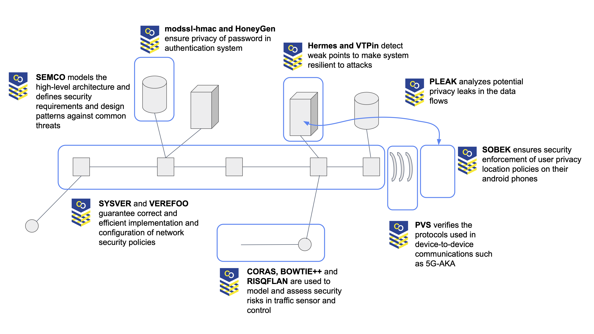

Task 3.3 “Software Development Lifecycle” of CyberSec4Europe had as one of its main goals to identify research challenges, requirements and approaches in all stages of the lifecycle of software. 

# Research Challenges in Secure Software Lifecycle

One of the main outcomes was the following set of research challenges related to security and privacy issues in the lifecycle of software:

1. Assessing Security and Privacy Through the Life Cycle Short-term research
2. Assessing Privacy Properties of Complex Systems Short-term research
3. Privacy protection and User Empowerment in IoT Short-term research
4. Securing Unsafe and Legacy Software Short-term research
5. Protecting Leaked Credentials Short-term research
6. Secure Access Control in Heterogeneous Systems Short-term research
7. Manageable and Understandable Security Engineering Short-term research
8. Unreliable Risk Estimates Short-term research
9. Automated and Verified Network Security Configuration in Highly Dynamic Environments
10. Scalable and Private Industrial Blockchain Short-term research
11. Scaling TEEs for Cloud Applications Short-term research

The challenges are described in detail in the document [D3.9 Research challenges and requirements for secure software development](https://cybersec4europe.eu/wp-content/uploads/2020/09/CS4E-D3.9-Research-challenges-and-requirements-for-secure-software-development-v1.1-Submitted.pdf).

# Proactive approaches for secure software development

The analysis of the research challenges lead to the identification of promising tool-supported approaches to be developed in order to address the challenges. A total of 13 tools to support different activities in the lifecycle of software was developed and demonstrated on a common smart-cities scenario as illustrated in the figure below.

Summary:

**Sobek**
* Tool: https://sigarra.up.pt/fcup/pt/pub_geral.pub_view?pi_pub_base_id=378511
* Main publication: 
Estrela, João Vasco Bispo. "Android Security by Introspection." (2019). Universidade do Porto

**Hermes**
* Tool: https://github.com/rolandomar/hermes
* Main publications: 
João Soares, R. F. (2021). ZERMIA - A Fault Injector framework for testing Byzantine Fault Tolerant protocols. 15th International Conference on Network and System Security - NSS 2021. Springer - Lecture Notes in Computer Science (LNCS) series.

**RisQFLan**
* Tool: https://github.com/RisQFLan/RisQFLan/wiki
* Main publications: 
Maurice H. ter Beek, Axel Legay, Alberto Lluch Lafuente, and Andrea Vandin. 2021. Quantitative Security Risk Modeling and Analysis with RisQFLan. Comput. Secur. 109, C (Oct 2021). DOI:https://doi.org/10.1016/j.cose.2021.102381.

**Pleak**
* Tool: https://github.com/pleak-tools
* Main publications: 
Dumas, Marlon, et al. "Multi-level privacy analysis of business processes: the Pleak toolset." International Journal on Software Tools for Technology Transfer (2021): 1-21.

**Verefoo**
* Tool: https://github.com/netgroup-polito/verefoo
* Main publications: 
D. Bringhenti, G. Marchetto, R. Sisto, F. Valenza, J. Yusupov, ”A novel approach for security function graph configuration and deployment”, 7th IEEE Conference on Network Softwarization (NetSoft), 2021.

**CORAS**
* Tool: https://stverdal.github.io/#/
* Main publications: 
Erdogan, Gencer, et al. "A Systematic Mapping Study on Approaches for Al-Supported Security Risk Assessment."2021 IEEE 45th Annual Computers, Software, and Applications Conference (COMPSAC). IEEE, 2021.

**PVS**
* Tool: https://www.isa- afp.org/entries/Automated_Stateful_Protocol_Verification.html
* Main publications: 
Hess, Andreas V., et al. "Performing Security Proofs of Stateful Protocols." 34th IEEE Computer Security Foundations Symposium (CSF). IEEE, 2021.

**BowTiePlus**
* Tool: https://github.com/INSA-SINTEF/BowtiePlusPlus/
* Main publications: 
Meland, Per Håkon, et al. "A Systematic Mapping Study on Cyber Security Indicator Data." Electronics 10.9 (2021): 1092.

**HoneyGen**
* Tool: https://bitbucket.org/srecgrp/honeygen-generating-honeywords-using-representation-learning/
* Main publications: 
Dionysiou, Antreas, Vassilis Vassiliades, and Elias Athanasopoulos. "HoneyGen: Generating Honeywords Using Representation Learning." Proceedings of the 2021 ACM Asia Conference on Computer and Communications Security. 2021.

**VTPin**
* Tool: https://github.com/uberspot/VTPin
* Main publications: Sarbinowski, Pawel, et al. "VTPin: practical VTable hijacking protection for binaries." Proceedings of the 32nd Annual Conference on Computer Security Applications. 2016.

**Modssl-hmac**
* Tool: https://bitbucket.org/srecgrp/modssl-hmac-public/
* Main publications: Diomedous, Constantinos, and Elias Athanasopoulos. "Practical password hardening based on TLS." International Conference on Detection of Intrusions and Malware, and Vulnerability Assessment. Springer, Cham, 2019.

**Lethe**
* Tool: https://bitbucket.org/srecgrp/lethe-public/
* Main publications: Dionysiou, Antreas, and Athanasopoulos, Elias. "Lethe: Practical Data Breach Detection with Zero Persistent Secret State." European Symposium on Security and Privacy, IEEE. 2022.

**SEMCO**
* Tool: https://doi.org/10.1109/ICECCS.2019.00033
* Main publications: 
Rouland, Quentin, Brahim Hamid, and Jason Jaskolka. "Specification, detection, and treatment of STRIDE threats for software components: Modeling, formal methods, and tool support." Journal of Systems Architecture 117 (2021): 102073.

Further details about the tools and their demonstration can be found in [Deliverable D3.15: Proactive Approaches For Software Development](https://cybersec4europe.eu/wp-content/uploads/2022/01/D3.15-Proactive-approaches-for-secure-software-development-v1.0_submitted.pdf). Accompanying videos for each tool can be found on a dedicated [YouTube channel](https://www.youtube.com/channel/UCSAJ78frZjdUTooAC4t6Wuw).

# Research Roadmap for Secure Software Lifecycle

The research carried out within the task lead to the identification of long-term research avenues within Secure Software Lifecycle:

* Lightweight formal methods for industrial compliance
* Holistic approaches to privacy, utility and efficiency
* Privacy protection in untrusted IoT environments
* Hardening by design
* Credentials-protecting authentication
* Scalable formal models, verification and synthesis Lightweight run-time security verification
* Ensure continuous service and minimal maintenance Pivoting attacks
* Risk estimates with dynamic data sources
* Automated verified configuration for large-scale networks Autonomic elicitation of security policies
* Industry-ready scalable, privacy-preserving blockchains
* Adaptable by-design TEEs

# Cybersecurity Research and Areas Priority

--- | Governance and Capacity Building | Trustworthy Ecosystems of Systems | Trust-Building Blocks | Disruptive Emerging Development
--- | --- | --- | --- | ---
Example Asset  | :heavy_check_mark: | - |  - | :heavy_check_mark: 
SOBEK  |  ---  | --- | :heavy_check_mark: | --- 
HERMES |  ---  | --- | :heavy_check_mark: | --- 
RisQFlan |  ---  | :heavy_check_mark: | :heavy_check_mark: | --- 
Pleak |  ---  | --- | :heavy_check_mark: | --- 
Verefoo |  ---  | --- | :heavy_check_mark: | --- 
CORAS |  ---  | :heavy_check_mark: | :heavy_check_mark: | --- 
PVS |  ---  | --- | :heavy_check_mark: | --- 
BowTiePlus |  ---  | :heavy_check_mark: | :heavy_check_mark: | --- 
HoneyGen |  ---  | --- | :heavy_check_mark: | --- 
VTPin |  ---  | --- | :heavy_check_mark: | --- 
Modssl-hmac |  ---  | --- | :heavy_check_mark:| --- 
Lethe |  ---  | --- | :heavy_check_mark:| --- 
SEMCO |  ---  | --- | :heavy_check_mark: | --- 

--- | Collaborative Networks| Education & Training | Certification | Secure Platforms of Platforms | Infrastructure Protection | Holistic Data Protection | AI-based Security | Systems Security & Security Lifetime Management | Secure Architectures for Next Generation Communication | Secure Quantum Technologies | Secure AI Systems | Personalized Privacy Protection
--- | --- | --- | ---  | --- | --- | --- | --- | --- | --- | --- | --- | --- 
SOBEK  |  ---  | --- | --- | --- | :heavy_check_mark: | --- | --- | :heavy_check_mark: | --- | --- | --- | :heavy_check_mark:
HERMES |  ---  | --- | --- | --- | :heavy_check_mark: | --- | --- | :heavy_check_mark: | --- | --- | --- | ---
RisQFlan |  ---  | --- | --- | --- |---| --- | --- | :heavy_check_mark: | --- | --- | --- | ---
Pleak |  ---  | --- | --- | --- |---| --- | --- | :heavy_check_mark: | --- | --- | --- | :heavy_check_mark:
Verefoo |  ---  | --- | --- | --- |---| --- | --- | :heavy_check_mark: | --- | --- | --- | ---
CORAS |  ---  | --- | --- | --- |---| --- | --- | :heavy_check_mark: | --- | --- | --- | ---
PVS |  ---  | --- | :heavy_check_mark: | --- |---| --- | --- | :heavy_check_mark: | --- | --- | --- | ---
BowTiePlus |  ---  | --- | --- | --- |---| --- | --- | :heavy_check_mark: | --- | --- | --- | ---
HoneyGen |  ---  | --- | --- | --- |---| --- | --- | :heavy_check_mark: | --- | --- | --- | ---
VTPin |  ---  | --- | --- | --- |---| --- | --- | :heavy_check_mark: | --- | --- | --- | ---
Modssl-hmac |  ---  | --- | --- | --- |---| --- | --- | :heavy_check_mark: | --- | --- | --- | ---
Lethe |  ---  | --- | --- | --- |---| --- | --- | :heavy_check_mark: | --- | --- | --- | ---
SEMCO |  ---  | --- | --- | --- |---| --- | --- | :heavy_check_mark: | --- | --- | --- | ---
